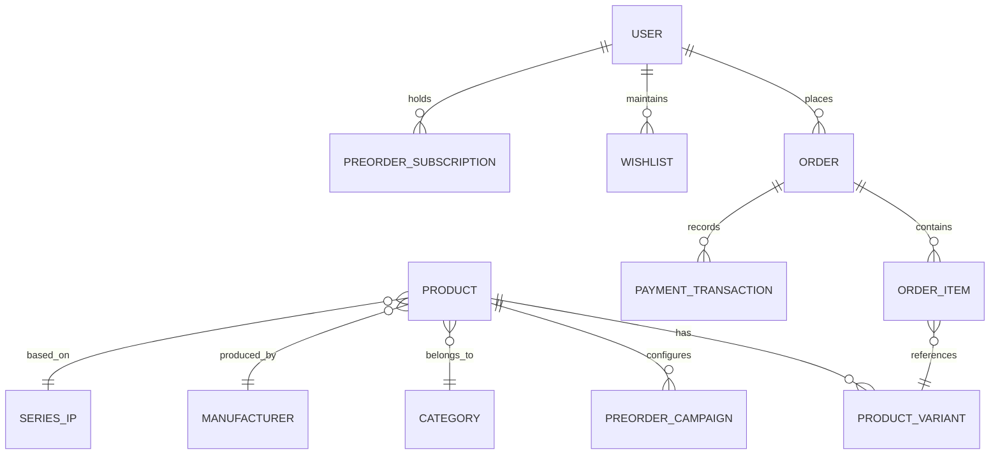

# TÀI LIỆU YÊU CẦU DỰ ÁN (SOFTWARE REQUIREMENTS SPECIFICATION - SRS)
# NỀN TẢNG THƯƠNG MẠI ĐIỆN TỬ BÁN MÔ HÌNH (FIGURE & COLLECTIBLES HOBBY STORE)

---

## 1. TỔNG QUAN DỰ ÁN (PROJECT OVERVIEW)

### 1.1. Bối cảnh & Mục tiêu
Thị trường mô hình sưu tầm (Figure, Gunpla, Resin Statue, Art Toy/Blindbox, Action Figure...) tại Việt Nam và quốc tế đang phát triển mạnh mẽ với tệp khách hàng đặc thù: yêu cầu độ chính xác cao về nguồn gốc xuất xứ (Auth/Chính hãng), tính năng đặt trước dài hạn (Pre-order từ 3 tháng đến hơn 1 năm), cơ chế đặt cọc (Deposit), theo dõi lịch phát hành, bảo quản và vận chuyển chống gãy vỡ hộp/mô hình.

Hệ thống được xây dựng nhằm cung cấp một nền tảng thương mại điện tử chuyên biệt hóa toàn diện cho mặt hàng mô hình, tối ưu trải nghiệm cho người sưu tầm (Collector) và tối ưu quy trình vận hành kho - đơn hàng Pre-order cho quản trị viên.

### 1.2. Phạm vi sản phẩm (Product Scope)
Hệ thống hỗ trợ quản lý và phân phối đa dạng các nhóm mặt hàng:
- **Scale Figures**: Tỉ lệ chuẩn 1/4, 1/6, 1/7, 1/8, Non-scale...
- **Chibi / Art Toys**: Nendoroid, Pop Up Parade, Blindbox, Designer Toys.
- **Action Figures**: Figma, S.H.Figuarts, Mafex, Revoltech...
- **Model Kits**: Gunpla (Bandai), Plamo (Kotobukiya, Suyata, Wave...), đồ chơi lắp ráp cơ khí.
- **Resin Statues / High-end Collectibles**: Tượng đúc nhựa Polyresin/PU, kích thước lớn, có đánh số thứ tự (Edition Serial Number).
- **Phụ kiện & Dụng cụ (Hobby Accessories)**: Kìm cắt, dao gọt, sơn mài/gốc nước, bút kẻ lằn, decal nước, tủ/hộp trưng bày, đèn LED chuyên dụng.

---

## 2. PHÂN QUYỀN & CHÂN DUNG NGƯỜI DÙNG (ROLES & ACTORS)

| Vai trò | Mô tả |
| :--- | :--- |
| **Khách vãng lai (Guest)** | Người dùng chưa đăng nhập: Duyệt danh mục, tìm kiếm, xem chi tiết mô hình, lịch phát hành, kiểm tra giá và tồn kho. |
| **Khách hàng (Customer / Collector)** | Người dùng đã xác thực: Mua hàng có sẵn, đặt cọc Pre-order, theo dõi tiến độ sản xuất/về hàng, thanh toán phần còn lại, tích điểm thành viên, đánh giá sản phẩm, quản lý bộ sưu tập (Wishlist/Collection). |
| **Nhân viên vận hành (Staff / Order & Inventory Manager)** | Quản lý kho, cập nhật trạng thái đơn hàng, xác nhận cọc, thông báo hàng về (Arrival Notice), tạo vận đơn, xử lý yêu cầu đổi trả/bảo hiểm gãy vỡ. |
| **Quản trị viên (Admin)** | Toàn quyền kiểm soát danh mục sản phẩm, cấu hình sự kiện Flash Sale/Pre-order Early Bird, báo cáo doanh thu, quản lý tài khoản nhân viên, cấu hình cổng thanh toán và phí vận chuyển. |

---

## 3. YÊU CẦU CHỨC NĂNG CHI TIẾT (FUNCTIONAL REQUIREMENTS)

### 3.1. Phân hệ Quản lý Danh mục & Thuộc tính sản phẩm đặc thù (FR-01)
Mặt hàng mô hình có hệ thống thuộc tính phức tạp hơn hàng tiêu dùng thông thường:

1. **Bộ lọc theo tính chất mô hình**:
   - **Tỉ lệ (Scale)**: 1/4, 1/6, 1/7, 1/8, 1/12, Non-scale, SD, HG, RG, MG, PG...
   - **Nhà sản xuất (Manufacturer/Maker)**: Good Smile Company, Alter, Kotobukiya, Bandai Spirits, Prime 1 Studio, Apex, Aniplex, Max Factory...
   - **Thương hiệu/Nguyên tác (IP / Series / Anime / Manga / Game)**: Fate/Grand Order, One Piece, Genshin Impact, Evangelion, Dragon Ball, Marvel...
   - **Tên nhân vật (Character)**: Hỗ trợ tìm kiếm theo tên Romaji, Kanji, Tiếng Anh, Tiếng Việt.
   - **Nhà điêu khắc / Họa sĩ minh họa (Sculptor / Illustrator)**: Giúp người sưu tầm chuyên nghiệp tìm kiếm theo nghệ sĩ.
   - **Chất liệu**: PVC, ABS, Polyresin, PU, Die-cast kim loại...

2. **Trạng thái kinh doanh sản phẩm**:
   - **Hàng có sẵn (In-Stock)**: Có thể giao ngay.
   - **Đặt trước (Pre-Order)**: Chưa phát hành, cần đặt cọc trước.
   - **Late Pre-Order (Đặt cọc bổ sung)**: Suất đặt muộn với số lượng giới hạn.
   - **Sắp về (Incoming / Restock)**: Đang trong quá trình vận chuyển quốc tế về kho.
   - **Cháy hàng (Sold Out / Out of Stock)**: Cho phép bật nút "Nhận thông báo khi có hàng lại".

3. **Tình trạng hàng hóa (Condition / Box State)**:
   - *New Seal*: Mới 100% nguyên seal hộp của hãng.
   - *BIB (Back In Box)*: Đã mở kiểm tra hoặc trưng bày trong điều kiện hoàn hảo, phụ kiện đầy đủ.
   - *Damage Box (Cấn góc/Móp hộp do vận chuyển)*: Thanh lý giảm giá kèm ảnh chụp chi tiết góc hộp bị móp.

4. **Trưng bày đa phương tiện & Thư viện ảnh**:
   - Ảnh độ phân giải cao có zoom chi tiết góc cạnh (khuôn mặt, đường sơn, chi tiết khớp).
   - Video unboxing/review hoặc nhúng video 360 độ xoay quanh mô hình.
   - Cảnh báo sản phẩm kèm bonus đặt trước (AmiAmi Exclusive, Good Smile Bonus Base, Art Board...).

---

### 3.2. Cơ chế Đặt trước & Quản lý Cọc chuyên biệt (FR-02 - Pre-Order Lifecycle)
Đây là tính năng cốt lõi bắt buộc đối với nền tảng bán mô hình:

```
[Mở Pre-order] 
      │
      ▼
[Khách chọn: Đặt cọc 20%-50% HOẶC Trả thẳng 100%]
      │
      ▼
[Xác nhận cọc & Cấp mã Pre-Order Ticket]
      │
      ▼
[Hãng thông báo ngày xuất xưởng (Release Date Update)]
      │
      ▼
[Hàng cập cảng / Về kho nội địa]
      │
      ▼
[Hệ thống gửi Email/SMS/App Push: Yêu cầu thanh toán nốt số tiền còn lại]
      │
      ├─► (Khách thanh toán nốt trong vòng 7 - 14 ngày) ──► [Đóng gói & Giao hàng]
      │
      └─► (Quá hạn không thanh toán) ──► [Hủy cọc theo chính sách / Nhượng lại suất (Slot Pass)]
```

1. **Cấu hình Pre-order từ Admin**:
   - Hạn chót nhận cọc (Order Deadline).
   - Tháng phát hành dự kiến (Estimated Release Month/Quarter/Year) + Cảnh báo hoãn phát hành (Delay Notice).
   - Tỷ lệ cọc linh hoạt: Cọc cố định (VD: 500.000 VNĐ) hoặc theo % giá trị (20%, 30%, 50%).
   - Tùy chọn giảm giá cho khách trả thẳng 100% (Full Payment Discount).

2. **Quản lý vé cọc của khách hàng (Pre-order Dashboard)**:
   - Khách theo dõi danh sách tất cả các đơn Pre-order chưa về hàng.
   - Hiển thị tiến độ: Đã cọc -> Đang sản xuất -> Đã phát hành tại Nhật/Trung -> Đang về VN -> Đã về kho -> Chờ tất toán -> Hoàn tất.
   - Nhắc hẹn thanh toán số tiền còn lại (Balance Payment) tự động qua Email/Zalo ZNS/SMS.
   - Cho phép gia hạn tất toán (tối đa N ngày) hoặc chuyển nhượng suất cọc (Transfer Slot) nếu shop hỗ trợ.

---

### 3.3. Phân hệ Tìm kiếm & Trải nghiệm Người dùng (FR-03)
1. **Tìm kiếm thông minh (Fuzzy Search & Autocomplete)**:
   - Hỗ trợ gõ sai dấu, tìm kiếm theo tên viết tắt, biệt danh (e.g. "Gundam Bà Cụ", "Miku 1/7", "Nendoroid Denji").
   - Gợi ý từ khóa ngay khi gõ kèm thumbnail mô hình và trạng thái (Pre-order/In-stock).
2. **Lịch phát hành mô hình (Release Calendar)**:
   - Giao diện dạng Calendar theo tháng/năm cho phép Collector theo dõi tháng nào nhân vật nào xuất xưởng để chuẩn bị tài chính.
3. **Danh sách mong muốn (Wishlist & Grail List)**:
   - Cho phép đánh dấu sản phẩm "Holy Grail" (Mô hình mơ ước).
   - Tự động gửi thông báo khi có hàng restock hoặc có khách khác pass lại hàng 2nd hand.

---

### 3.4. Phân hệ Giỏ hàng & Đặt hàng (Checkout & Cart Management) (FR-04)
1. **Tách đơn thông minh (Smart Order Splitting)**:
   - **Vấn đề**: Khách bỏ vào giỏ hàng cả "Hàng có sẵn" và "Mô hình Pre-order tháng 12". Không thể giao chung một lần.
   - **Giải pháp**: Hệ thống tự động chia đơn hàng thành:
     * *Đơn 1*: Hàng có sẵn -> Giao ngay lập tức.
     * *Đơn 2*: Hàng Pre-order -> Lưu thành phiếu cọc, giao khi hàng về.
2. **Tùy chọn đóng gói bảo vệ hàng hóa (Collector Packaging Options)**:
   - Đóng gói tiêu chuẩn (Bọc bóng khí + Thùng carton cứng).
   - Đóng gói cao cấp chống móp hộp (Bọc góc nhựa/xốp bảo vệ 8 góc hộp mô hình + Thùng 5 lớp + Màng xốp PE Foam 5-10mm).
   - Tùy chọn kiểm tra hộp trước khi gửi (Chụp ảnh góc hộp gửi qua ứng dụng trước khi niêm phong vận đơn).
3. **Tích hợp cổng thanh toán**:
   - Chuyển khoản ngân hàng tự động nhận diện mã đơn qua VietQR / SePay / Casso.
   - Ví điện tử: MoMo, ZaloPay, VNPay-QR.
   - Thẻ quốc tế Visa/Mastercard/JCB (Stripe / OnePay).
   - Ship COD (chỉ áp dụng cho hàng có sẵn hoặc phần thanh toán nốt, KHÔNG áp dụng COD cho tiền cọc Pre-order).

---

### 3.5. Phân hệ Vận chuyển & Giao nhận chuyên biệt (FR-05)
1. **Tính cước theo thể tích quy đổi (Volumetric Weight)**:
   - Mô hình nhựa và tượng Resin thường có vỏ hộp rất to nhưng nhẹ. Phải tự động tính:
     $$\text{Khối lượng quy đổi (kg)} = \frac{\text{Dài} \times \text{Rộng} \times \text{Cao (cm)}}{5000 \text{ hoặc } 6000}$$
   - Tích hợp trực tiếp API các hãng vận chuyển: GHTK, GHN, Viettel Post, AhaMove/Grab (giao siêu tốc nội thành bảo đảm an toàn).
2. **Bảo hiểm hàng hóa giá trị cao**:
   - Tự động tính phí bảo hiểm hàng dễ vỡ cho đơn hàng giá trị trên 3.000.000 VNĐ.
   - Quy định quay video mở hàng (Unboxing Video) gắn liền với chính sách đổi trả / bù hàng gãy khớp do vận chuyển.

---

### 3.6. Phân hệ Thành viên & Điểm thưởng (Loyalty / Hobby Points) (FR-06)
1. **Hạng thành viên Collector**:
   - *Bronze Collector* -> *Silver Collector* -> *Gold Collector* -> *Master Collector*.
   - Đặc quyền: Chiết khấu tiền cọc (Hạng cao chỉ cần cọc 10%), ưu tiên giữ slot các bản giới hạn (Limited Edition / Wonder Festival Exclusive).
2. **Tích điểm (Hobby Coins)**:
   - Tích lũy 1-3% giá trị đơn hàng thành điểm thưởng để giảm giá cho các đơn Pre-order kế tiếp.
   - Thưởng điểm khi đăng tải bài review ảnh mô hình lên web.

---

### 3.7. Phân hệ Quản trị Kho & Vận hành (Admin / Back-office) (FR-07)
1. **Quản lý đợt hàng về (Shipment Batch Tracking)**:
   - Quản lý kiện hàng từ kho trung chuyển nước ngoài (Nhật / Trung / Mỹ) về kho nội địa.
   - Phân bổ tự động: Khi 1 thùng hàng (VD: 20 con Nendoroid Gojo) về kho, hệ thống tự động gán vào danh sách khách hàng đã cọc theo thứ tự thời gian đặt cọc (FIFO).
2. **Quản lý số Serial mô hình giới hạn**:
   - Tượng Resin thường chỉ sản xuất 99 hay 300 bản toàn cầu kèm chứng chỉ (Certificate of Authenticity - COA). Cho phép ghi chú số Serial (e.g. #045/300) vào từng sản phẩm xuất kho.
3. **Báo cáo & Thống kê**:
   - Báo cáo tỷ lệ bùng cọc (Drop-off rate).
   - Dự báo dòng tiền cần chuẩn bị để nhập hàng khi đến đợt phát hành.
   - Thống kê sản phẩm bán chạy theo Hãng sản xuất và theo IP (Anime/Game).

---

## 4. YÊU CẦU PHI CHỨC NĂNG (NON-FUNCTIONAL REQUIREMENTS - NFR)

### 4.1. Hiệu năng & Chịu tải (Performance & Scalability)
- **Tốc độ tải trang**: First Contentful Paint (FCP) < 1.2s; Largest Contentful Paint (LCP) < 2.5s trên đường truyền 4G.
- **Chịu tải cao đột biến (High Concurrency / Drop Selling)**: Hệ thống phải chịu được lưu lượng truy cập lớn (hàng nghìn user đồng thời) trong các thời điểm "mở cổng Pre-order cho sản phẩm hot giới hạn" hoặc "Flash Sale" mà không bị sập hay bán vượt quá tồn kho (Over-selling). Cần áp dụng Redis Queue / Distributed Locking.
- **Tối ưu hình ảnh**: Ảnh mô hình phải được tự động nén sang định dạng WebP/AVIF, hỗ trợ responsive image srcSet theo kích thước màn hình, lưu trữ trên CDN.

### 4.2. Bảo mật & Toàn vẹn dữ liệu (Security)
- Toàn bộ kết nối sử dụng giao thức HTTPS / TLS 1.3.
- Chống bot cào hàng (Anti-bot / Rate limiting / Cloudflare Turnstile / reCAPTCHA v3) tại các nút bấm "Mua hàng", "Đặt cọc Pre-order".
- Tuân thủ quy chuẩn mã hóa mật khẩu người dùng (Bcrypt / Argon2id) và dữ liệu thanh toán tokenized.

### 4.3. Giao diện & Trải nghiệm (UI/UX)
- Thiết kế hiện đại, phong cách Pop Culture / Hobbyist, hỗ trợ Dark Mode và Light Mode (Dark Mode tôn màu sắc chi tiết mô hình rất tốt).
- Tối ưu 100% cho thiết bị di động (Mobile First) vì hơn 75% tệp Collector lướt mua trên smartphone.
- Giao diện chi tiết sản phẩm hiển thị trực quan các thông số: Hộp, Phụ kiện đi kèm, Ngày phát hành, Nguồn gốc xuất xứ.

---

## 5. MÔ HÌNH DỮ LIỆU CỐT LÕI (CORE DATA MODEL SCHEMA OVERVIEW)



### Các bảng dữ liệu chính (Core Tables):
1. **`products`**: `id`, `name`, `slug`, `scale`, `material`, `sculptor`, `condition_type` (NEW_SEAL, BIB, DAMAGE_BOX), `manufacturer_id`, `series_id`, `description`, `thumbnail_url`.
2. **`product_variants`**: `id`, `product_id`, `sku`, `edition_name` (Standard, DX Edition, Bonus Exclusive), `price`, `stock_quantity`, `weight_gram`, `dimension_l_w_h`.
3. **`preorder_campaigns`**: `id`, `product_id`, `deposit_amount`, `full_price_discount`, `deadline_date`, `release_month_est`, `release_status` (UPCOMING, DELAYED, RELEASED, CANCELLED).
4. **`orders`**: `id`, `user_id`, `order_code`, `order_type` (INSTOCK, PREORDER, MIXED), `total_amount`, `deposit_amount_paid`, `balance_amount_due`, `status` (PENDING, DEPOSITED, ARRIVED, PAID, SHIPPING, COMPLETED, CANCELLED).
5. **`preorder_tickets`**: `id`, `order_id`, `user_id`, `variant_id`, `deposit_paid`, `remaining_balance`, `balance_due_date`, `notification_sent_count`, `ticket_status`.
6. **`manufacturers`**: `id`, `name`, `country`, `logo_url`.
7. **`series_ips`**: `id`, `title`, `franchise_type` (ANIME, MANGA, GAME, MOVIE, ORIGINAL).

---

## 6. KIẾN TRÚC HỆ THỐNG ĐỀ XUẤT (RECOMMENDED TECH STACK)

- **Frontend**:
  - Next.js (React 19 / App Router) / TailwindCSS / Lucide Icons.
  - Hỗ trợ SSR/SSG tối ưu SEO cho hàng ngàn sản phẩm nhân vật và IP.
  - Zustand hoặc TanStack Query quản lý state.
- **Backend**:
  - Node.js (NestJS) hoặc Golang / Python FastAPI.
  - RESTful API & GraphQL (cho truy vấn linh hoạt chi tiết mô hình).
- **Database & Cache**:
  - PostgreSQL: Lưu trữ dữ liệu quan hệ giao dịch, tiền cọc, đơn hàng.
  - Redis: Cache danh mục, giỏ hàng, Rate limit, xử lý hàng đợi (BullMQ) gửi thông báo hàng về và khóa kho chống over-selling.
  - Elasticsearch / Meilisearch: Bộ máy tìm kiếm siêu tốc theo tên nhân vật, series, hãng sản xuất.
- **Lưu trữ & CDN**:
  - Cloudflare R2 / AWS S3 + Image Resizer tự động tạo ảnh WebP đa kích thước.
- **Thông báo & Tích hợp**:
  - Email (Resend / AWS SES), SMS OTP / Zalo ZNS cho thông báo cọc & hàng về.
  - Giao vận: API GHTK, GHN, Viettel Post.
  - Thanh toán: Webhook VietQR (SePay/Casso), PayOS, MoMo, VNPay, Stripe.

---

## 7. KẾ HOẠCH TRIỂN KHAI THEO GIAI ĐOẠN (ROADMAP)

### Giai đoạn 1: MVP (Minimum Viable Product) - 6 đến 8 tuần
- [x] Quản lý sản phẩm cơ bản (Hàng có sẵn + Pre-order đơn giản).
- [x] Đăng ký / Đăng nhập (Email, Google Auth).
- [x] Giỏ hàng, Đặt cọc chuyển khoản quét mã VietQR tự động.
- [x] Quản lý đơn hàng và tính phí ship cơ bản.
- [x] Trang Admin CRUD sản phẩm, duyệt cọc thủ công/bán tự động.

### Giai đoạn 2: Tối ưu hóa & Chuyên biệt hóa Hobby Store - 4 tuần tiếp theo
- [x] Tính năng tự động chia đơn hàng (Hàng có sẵn vs Pre-order).
- [x] Vòng đời Pre-order hoàn chỉnh: Thông báo hàng về, hẹn thanh toán số tiền còn lại.
- [x] Tích hợp trực tiếp API Đơn vị vận chuyển (tính khối lượng quy đổi, đẩy đơn tự động).
- [x] Tìm kiếm nâng cao Meilisearch (theo Series IP, Hãng sản xuất, Tỉ lệ, Tình trạng hộp).
- [x] Hệ thống lịch phát hành mô hình (Release Calendar).

### Giai đoạn 3: Nâng cao & Cộng đồng (Advanced Features) - 4 đến 6 tuần
- [x] Hệ thống điểm thưởng Collector Club (Hobby Coins, tích điểm, phân hạng thành viên).
- [x] Sàn ký gửi / Chợ pass mô hình 2nd hand có bảo trợ của Shop.
- [x] Góc người sưu tầm (Showroom/Gallery): Khách hàng đăng ảnh góc trưng bày gắn kèm link sản phẩm.
- [x] Chống bot săn hàng giới hạn và tối ưu bộ nhớ đệm chịu tải cao.
